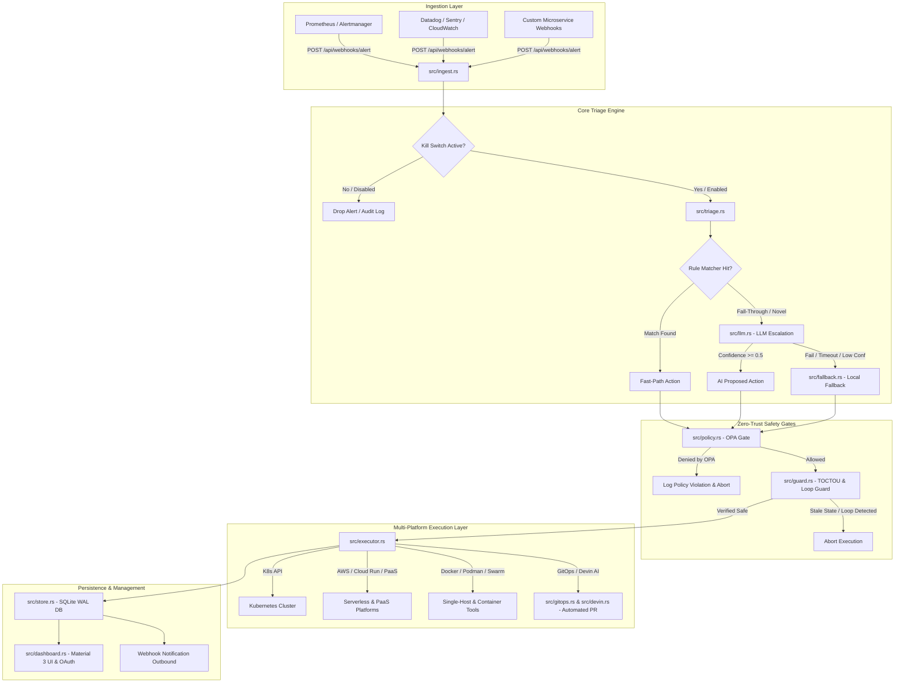

# Cheezer Core — End-to-End System Architecture & Flow Guide

> **Target Audience:** Engineers, SREs, and Contributors joining the project.  
> **Goal:** Provide a complete, step-by-step technical breakdown of Cheezer Core so that any developer can understand every line of code, data flow, safety invariant, and platform integration as if they designed and built the system themselves.

---

## 1. Project Overview & Core Mission

**Cheezer Core** is an enterprise-grade, autonomous SRE self-healing control plane written in high-performance Rust (`axum` + `tokio`). 

It acts as an automated 24/7 Reliability Engineer that:
1. **Ingests real-time telemetry and incident alerts** from Prometheus, Alertmanager, Datadog, Sentry, AWS CloudWatch, and custom webhooks.
2. **Evaluates incidents using a 2-tier decision matrix**:
   - **Fast-Path Rule Engine** (<1ms latency) for known failure modes.
   - **LLM Escalation Engine** (OpenAI / Groq / Devin AI) for novel or complex anomalies.
3. **Enforces strict zero-trust safety gates**:
   - **OPA (Open Policy Agent)** fail-closed policy validation.
   - **TOCTOU (Time-of-Check to Time-of-Use)** re-validation to prevent stale state execution.
   - **Cascading Loop Breakers** to block endless remediation feedback loops.
4. **Executes remediations natively across 19 deployment platforms** (Kubernetes, AWS Lambda/App Runner, Cloud Run, Azure, Fly.io, Railway, Heroku, Netlify, Docker, Podman, Swarm, Nomad, GitHub, Devin AI, etc.).
5. **Maintains Control Plane Self-Resilience (Cheezer HA Pair & Watchdog)**:
   - Operating out-of-band on dedicated control plane nodes separate from customer workloads.
   - Running a **Primary + Standby HA Pair** monitored via a TCP proof-of-life Watchdog daemon (`src/watchdog.rs`). If the primary Cheezer server crashes, the standby instance automatically promotes to primary within 3 missed heartbeats.
   - Core Design Principle: *"Cheezer recovers customer infrastructure; an independent Watchdog quorum recovers Cheezer."*
6. **Generates GitOps Pull Requests** for permanent code-level bug fixes.
7. **Provides an interactive Google Material 3 operational dashboard** with OAuth 2.0 / SSO integration gateways.

---

## 2. High-Level Architecture Diagram



---

## 3. Deep Dive into Every Module & Source File

Here is the exact responsibility, contract, and workflow for each source file in `src/`:

### 3.1 `src/main.rs` — Application Entry Point & Role Coordinator
* **Role:** Sets up logging, parses CLI arguments (`--role=primary`, `--role=standby`, `--role=worker`, `--port=9090`), initializes the SQLite database schema (`store::init_db()`), and binds the Axum web server.
* **Multi-Role High Availability:**
  * `primary`: Runs full ingestion, triage, OPA policy evaluation, execution, watchdog election, and web dashboard.
  * `standby`: Runs a passive heartbeat monitor watching the primary node via `src/watchdog.rs`. If the primary misses 3 heartbeats, the standby node promotes itself to `primary`.
  * `worker`: Dedicated execution worker for offloading heavy jobs.

### 3.2 `src/ingest.rs` — Multi-Source Alert Parser & Ingestion Engine
* **Endpoint:** `POST /api/webhooks/alert`
* **Workflow:**
  1. Validates authentication token headers (`X-Cheezer-Token` or query key).
  2. Checks global kill switch `ENABLE_AUTONOMOUS_REMEDIATION=true`. If set to `false`, ingestion stops immediately and returns HTTP 403 / 503.
  3. Parses incoming JSON payload from standard formats (Alertmanager vector, Datadog JSON, Sentry webhook, AWS SNS CloudWatch alert).
  4. Extracts key metadata: `alertname`, `severity`, `pod`, `namespace`, `deployment`, `service`, `container`, `provider`.
  5. Passes parsed `Alert` struct into `triage::process_alert(alert)`.

### 3.3 `src/triage.rs` — 2-Tier Incident Triage & Decision Engine
* **Fast-Path Rule Engine (<1ms):**
  * Evaluates alert signature against deterministic regex rules:
    * `CrashLoopBackOff` → `Action::RestartPod`
    * `OOMKilled` → `Action::ScaleDeployment` (increase replicas or memory limits)
    * `HighCPUUsage` → `Action::ScaleDeployment`
    * `DiskFull` → `Action::LogReviewNeeded`
    * `DatabaseLatencySpike` → `Action::RestartPod`
    * `UnauthorizedAccess` → `Action::CordonNode`
* **LLM Escalation Engine (Fallback):**
  * If an alert signature does not match any pre-configured rule, it escalates to `src/llm.rs` for AI analysis.
  * Ensures that non-standard or novel infrastructure anomalies are handled intelligently.

### 3.4 `src/llm.rs` — Adaptive 4-Tier LLM Router & Cost Optimizer
* **Cost-Aware Model Tiering (`select_llm_model`):** Calling heavy LLMs (GPT-4o / Claude 3.5 Sonnet) on every alert is prohibitively expensive ($0.03–$0.15/call). Cheezer Core solves this with a dynamic 4-tier model router:
  * **Tier 0 — Fast-Path Rule Engine ($0.00 / <1ms):** Handles 70–80% of repetitive alerts (`CrashLoopBackOff`, `OOMKilled`) with zero LLM API cost.
  * **Tier 1 — Fast Lightweight LLM ($0.0001 / <300ms):** Routes minor warnings & simple novel alerts to lightweight models (`gpt-4o-mini`, `llama-3.2-3b`, `gemini-1.5-flash`), saving 99% of LLM compute costs.
  * **Tier 2 — Deep Reasoning LLM ($0.01 / 1–2s):** Routes critical/fatal multi-service cascading failures to heavy models (`gpt-4o`, `claude-3-5-sonnet`) ONLY when deep reasoning is required.
  * **Tier 3 — Agentic Code Engineer (Devin AI):** Escalates persistent infrastructure failures to automated GitOps code fix PRs.
* **Protocol & Schema:** OpenAI / Groq / Ollama / Devin AI JSON-mode format.
* **Workflow:**
  1. `select_llm_model(alert)` inspects severity and alert signature to choose optimal model tier.
  2. Constructs a strict prompt with incident context, active metrics, and action schemas.
  3. Invokes external LLM endpoint with a 10-second timeout circuit breaker.
  4. Parses returned JSON payload into `LlmResponse`:
     ```json
     {
       "incident_class": "NovelDatabaseDeadlock",
       "confidence": 0.92,
       "proposed_action": "RestartPod",
       "target": { "namespace": "production", "resource": "db-primary-0" },
       "reason": "Thread deadlock identified in locks"
     }
     ```
  5. **Confidence Gate:** If `confidence < 0.5`, rejects LLM decision and invokes `src/fallback.rs`.
  6. **Cost Telemetry:** Exposes cumulative `llm_cost_saved_dollars` ($) and real-time spend on dashboard API (`/api/metrics`).

### 3.5 `src/policy.rs` — OPA (Open Policy Agent) Fail-Closed Safety Gate
* **Engine:** Embedded OPA Rego policy evaluator.
* **Rules Enforced (`deny` logic):**
  * ❌ **Block Root Commands:** Denies any action executing `rm -rf /`, `chmod 777`, or dangerous shell strings.
  * ❌ **Namespace Protection:** Denies `DeleteNamespace` on `kube-system`, `production`, or `default`.
  * ❌ **Replica Bounds:** Denies scaling deployments above `max_replicas = 20` or below `min_replicas = 1`.
  * ❌ **Fail-Closed Guarantee:** If OPA policy evaluation fails, throws an error, or times out, the default decision is **DENY (Fail-Closed)**.

### 3.6 `src/guard.rs` — TOCTOU Safety & Loop Detection
* **TOCTOU (Time-of-Check to Time-of-Use) Verification:**
  * Before executing an action (e.g. restarting `pod-abc-123`), queries cluster/service state to ensure the resource still exists and hasn't already self-recovered.
* **Cascading Loop Breaker:**
  * Tracks remediation count for each resource in a sliding 15-minute window.
  * If a resource undergoes >3 remediations in 15 minutes, marks the loop as **CASCADING_LOOP_DETECTED** and escalates to human approval instead of repeating actions endlessly.

### 3.7 `src/executor.rs` — Unified Multi-Platform Remediation Layer
* **19 Supported Native Platforms:**
  1. **Kubernetes:** Pod restarts, deployment scaling, node cordoning via K8s REST API.
  2. **AWS Lambda / CloudWatch:** Function redeployments and concurrency throttling.
  3. **AWS App Runner:** Service restarts and autoscaling policy updates.
  4. **Google Cloud Run:** Revision rollback and instance scaling.
  5. **Azure Functions / Container Instances:** Container restart triggers.
  6. **Fly.io / Render / Railway / Heroku / Netlify / Platform.sh:** PaaS API service rebuilds and restarts.
  7. **Docker / Docker Compose / Podman / Portainer / Swarm / Nomad:** Single-host container container lifecycle operations.
  8. **GitHub Actions / Devin AI:** Code-level remediation PR generation.

### 3.8 `src/gitops.rs` & `src/devin.rs` — Automated GitOps Code Repair
* For code-level bugs (syntax errors, memory leaks, unhandled exceptions), creates a Git patch or dispatches a task to Devin AI.
* Automatically opens a Pull Request on GitHub with detailed remediation notes and linked incident IDs.

### 3.9 `src/store.rs` — Persistent SQLite WAL Database
* Uses SQLite with Write-Ahead Logging (`WAL` mode) for ultra-fast concurrent access.
* Stores tables:
  * `incidents`: Full log of every incident, signature, mode (`rule`, `ai`, `fallback`), action, status, and execution timestamp.
  * `remediations`: Detailed execution step logs.
  * `credentials`: OAuth tokens and API keys encrypted at rest.
  * `watchers`: Monitored targets and workload health statuses.
  * `settings`: Global runtime configuration.

### 3.10 `src/dashboard.rs` — Google Material 3 UI & OAuth 2.0 Gateway
* Serves the single-page application (SPA) on `http://localhost:9090`.
* Features clean Material 3 light mode (`#F3F6FC` background, white elevation cards, Google Blue `#1A73E8` accents).
* Includes an interactive **OAuth 2.0 / SSO Authorization Gateway Modal** (`#oauth-modal`) with step-by-step handshake simulation (PKCE code exchange, scope grant, token vault storage).

### 3.11 `src/watchdog.rs` — Control Plane Resiliency & Dual-Node HA Failover
* **Architectural Decoupling:** Cheezer Core runs out-of-band on a separate control plane node or cloud server from the customer's monitored infrastructure (Kubernetes / AWS / Vercel).
* **Self-Resilience Guarantee:** To prevent Cheezer from becoming a single point of failure (SPOF), Cheezer implements an **HA Pair (Primary + Standby)** architecture monitored by an independent TCP proof-of-life Watchdog daemon.
```text
           ┌─────────────────────────────┐
           │      EXTERNAL WATCHDOG      │
           └──────────────┬──────────────┘
                          │ (TCP Proof-of-Life Probe)
          ┌───────────────┴───────────────┐
          ▼                               ▼
  ┌───────────────┐               ┌───────────────┐
  │ Cheezer       │  Heartbeat    │ Cheezer       │
  │ PRIMARY       │◄─────────────►│ STANDBY       │
  │ (Server A)    │               │ (Server B)    │
  └───────┬───────┘               └───────┬───────┘
          │                               │
          └───────────────┬───────────────┘
                          ▼
              Customer Infrastructure
```
* **Failure Domain Separation:**
  1. Primary node (`cheezer-core --role=primary`) binds a TCP watchdog listener (`watchdog::run_primary`).
  2. Standby node (`cheezer-core --role=standby`) polls the Primary node at regular intervals (`watchdog::run_backup_interval`).
  3. If Server A crashes or network fails, Standby misses 3 heartbeats, logs `Primary watchdog is dead! Backup taking over`, and promotes itself to **PRIMARY** to maintain continuous 24/7 incident response.
* **Pitch Principle:** *"Cheezer recovers customer infrastructure; an independent Watchdog quorum recovers Cheezer."*

---

## 4. End-to-End Walkthrough of a Real Incident

To see how everything works together, let's trace what happens when an alert fires:

```
[Incident: Kubernetes Pod CrashLoopBackOff in Namespace 'production']
```

1. **Alert Fired:** Prometheus Alertmanager sends a `POST` request to `http://localhost:9090/api/webhooks/alert`.
2. **Ingest Phase (`src/ingest.rs`):**
   - Validates webhook headers.
   - Confirms `ENABLE_AUTONOMOUS_REMEDIATION=true`.
   - Parses payload into `Alert { name: "CrashLoopBackOff", pod: "api-service-7f9b", namespace: "production" }`.
3. **Triage Phase (`src/triage.rs`):**
   - Evaluates signature `"CrashLoopBackOff"`. Matches Rule 1 (`RestartPod`).
   - Action generated: `Action::RestartPod { pod: "api-service-7f9b", namespace: "production" }`.
   - Mode set to `"rule"`.
4. **Policy Check Phase (`src/policy.rs`):**
   - Sends action to OPA Rego engine.
   - OPA checks: Action is not `DeleteNamespace`, does not use root execution commands. Result: **ALLOWED**.
5. **Guard Check Phase (`src/guard.rs`):**
   - Checks TOCTOU state: Pod `api-service-7f9b` still exists in cluster.
   - Checks loop history: Resource remediated 1 time in past 15 mins (threshold is 3). Result: **SAFE**.
6. **Execution Phase (`src/executor.rs`):**
   - Calls Kubernetes REST API: `DELETE /api/v1/namespaces/production/pods/api-service-7f9b`.
   - K8s Kubernetes Controller restarts the pod cleanly.
7. **Storage & Audit Phase (`src/store.rs`):**
   - Inserts row into SQLite `incidents` table: `status = "executed"`, `mode = "rule"`.
8. **UI & Webhook Notification Phase (`src/dashboard.rs`):**
   - Pushes live incident update to dashboard tab "Live Incidents & Circuit Breakers".
   - Sends outbound webhook notification to configured Slack/Teams endpoint.

---

## 5. How OAuth 2.0 / SSO Connections Work

In `src/dashboard.rs`, each connection card (GitHub, Vercel, AWS, GCP, Devin AI, etc.) provides a seamless **OAuth 2.0 / SSO Connection Gateway**:

1. User clicks **`🔑 Sign in with GitHub`** (or Vercel / AWS / GCP / etc.).
2. The UI opens `#oauth-modal` (Material 3 authorization dialog).
3. The modal displays:
   - Client ID: `cheezer_core_prod`
   - Requested Scopes: `read:org, repo, read:user, workflow`
   - Redirect URI: `http://localhost:9090/api/oauth/callback`
4. Clicking **"Authorize & Connect Account"** executes a 3-step OAuth PKCE handshake:
   - Step 1: Handshake initiation with platform OAuth gateway.
   - Step 2: Code exchange & token validation.
   - Step 3: Vault storage via `POST /api/connections/configure`.
5. The connection card state transforms into **`● CONNECTED (OAuth 2.0)`** showing identity handle `@zius-dev` and granting re-authorize and disconnect controls.

---

## 6. Verification, Testing & Chaos Engineering

### 6.1 Running Full Test Suite
To verify all unit tests, integration tests, and mock handlers:
```bash
cargo test
```
*(All 19/19 tests must pass cleanly)*

### 6.2 Code Linting & Hygiene
To verify zero Rust warnings:
```bash
cargo clippy -- -D warnings
```

### 6.3 Chaos Engineering Suite
To simulate real production failures (CrashLoopBackOff, OOMKilled, Database Latency, Cascading Remediation Loops):
```bash
./scripts/trigger-chaos-bug.sh all
```

---

## 7. Development & Release Workflow

1. **Local Build & Test:**
   ```bash
   cargo check
   cargo test
   ```
2. **Start Primary Core Engine:**
   ```bash
   cargo run --release -- --role=primary --port=9090
   ```
3. **Access Web Dashboard:**
   Open `http://localhost:9090` in your web browser.
